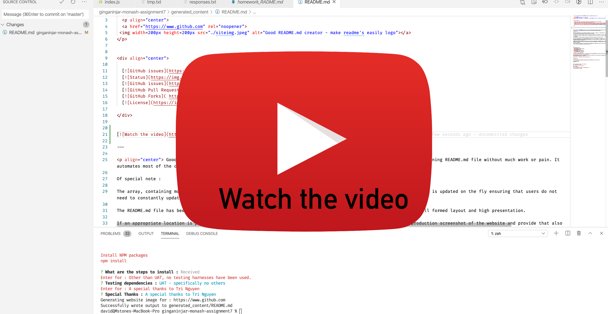

<h1 align="center">Welcome to Good README.md creator - make readme's easily 👋</h1>

  <p align="center">
  <a href=" https://ginganinjar.github.io/ginganinjar-monash-assignment7/" rel="noopener">
 </a>
</p>


<div align="center">

  [](/issues)
  []()  
  [](/issues)
  []()
  []()
  [](https://opensource.org/licenses/mit-license.php)

</div>

[](https://youtu.be/QUNrV7xauHI)
---

<p align="center"> This node based CLI application has been developed and designed to assist the developer with the gruelling task of creating a README.md file based on Githubs formatting standard.

The file _./templates/tmp.txt_ is the template README.md file. This file can be modified in accordance with the users requirements. The user may elect to insert an appropriate key inside this file and that will automatically be populated at the time of execution. The key format is defined by the use of the “<” and “>” characters. For example, the file ./tmp/responses.txt contains a stringify'ed array : the structure of that array is as follows : 

[inquirer input type],[The question asked to the user], [the field to be updated in the README.md file. In this scenario, the word <title> as defined in the ./tmp/responses.json file will take the answer from inputted CLI and generate a new README.md file with this content which is saved in the sub directory generated_content], [the default response which is updated every time the user makes a change], [null <- this field is used internally by the application and cannot be changed]

After the application completes, it will create two files (README.md & siteimg.jpeg) - These files will be contained in the directory, ./generated_content. Move these files to the root of your repository and everything is good to go.

The primary requirement of this assignment was to achieve the following : 

Functional application.

* GitHub repository with a unique name and a README describing project.

* The generated README includes the following sections: 

  * Title
  * Description
  * Table of Contents
  * Installation
  * Usage
  * License
  * Contributing
  * Tests
  * Questions

* The generated README includes 1 badge that's specific to the repository.


 
</p>

## 📝 Table of Contents
- [About](#about)
- [Getting Started](#getting_started)
- [Instalation](#deployment)
- [Usage](#usage)
- [License](#license)
- [Authors](#contributing)
- [Acknowledgments](#acknowledgement)
- [Questions](#questions)

## 🧐 Usage <a name = "about"></a>
 To assist in the design and build of a professional and easily used README.md file using a CLI editor from within NODE CLI console.

## 🏁 Getting Started <a name = "getting_started"></a>
These instructions will get you a copy of the project up and running on your local machine for development and testing purposes. See [deployment](#deployment) for notes on how to deploy the project on a live system.

### Installing & 🚀 Deployment <a name = "deployment"></a>

```sh
Clone the repo 

GIT CLONE git@github.com:ginganinjar/ginganinjar-monash-assignment7.git from your console.   

Install NPM packages
npm install 

```

## :mag: Testing  <a name = "built_using"></a>
UAT - specifically no others

## ✍️ Authors <a name = "contributing"></a>
David S.

## 🎉 Acknowledgements <a name = "acknowledgement"></a>
A special thanks to Tri Nguyen

### :copyright: License <a name = "license"></a>

[License](https://opensource.org/licenses/mit-license.php)


## :question: Questions <a name = "<questions"></a>
Questions, concers, comments ? 

Please feel free to contact me at : https://ginganinjar.github.io/contact.html

