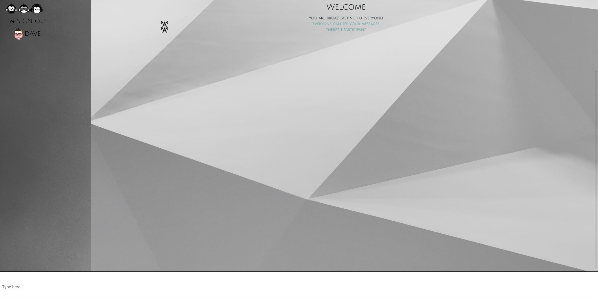

<h1 align="center">Welcome to Good readme generator 👋</h1>

  

  <a href="" rel="noopener">
  logo"></a>

  
    
  
  
  

---

 A well formed good readme generator for creating usable readme files quickly
      

## 📝 Table of Contents
- [About](#about)
- [Getting Started](#getting_started)
- [Deployment](#deployment)
- [Usage](#usage)
- [Built Using](#built_using)
- [TODO](../TODO.md)
- [Contributing](../CONTRIBUTING.md)
- [Authors](#authors)
- [Acknowledgments](#acknowledgement)

## 🧐 About 
To provide developers with a good looking, well constructed readme file for quick creation of repos

## 🏁 Getting Started 
These instructions will get you a copy of the project up and running on your local machine for development and testing purposes. See [deployment](#deployment) for notes on how to deploy the project on a live system.

### Prerequisites
None

### Installing
Clone / SSH / Pull

## 🎈 Usage 
Add notes about how to use the system.

## 🚀 Deployment 
Add additional notes about how to deploy this on a live system.

## ⛏️ Built Using 
- [MongoDB](https://www.mongodb.com/) - Database
- [Express](https://expressjs.com/) - Server Framework
- [VueJs](https://vuejs.org/) - Web Framework
- [NodeJs](https://nodejs.org/en/) - Server Environment

## ✍️ Authors 
- [@kylelobo](https://github.com/kylelobo) - Idea & Initial work

See also the list of [contributors](https://github.com/kylelobo/The-Documentation-Compendium/contributors) who participated in this project.

## 🎉 Acknowledgements 
- Hat tip to anyone whose code was used
- Inspiration
- References